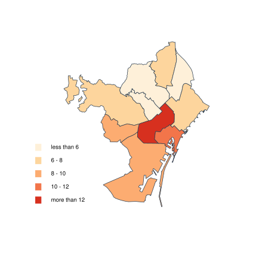
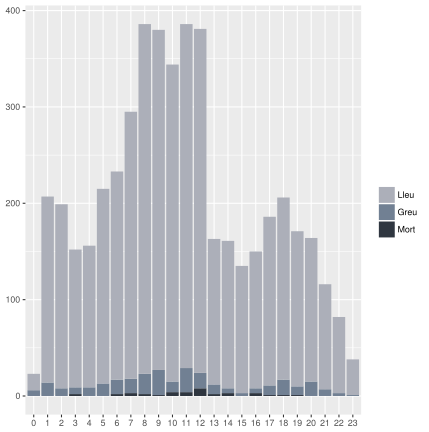
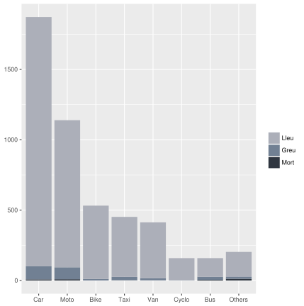

Pedestrian Accidentability in Barcelona
================
Joan M Lopez
March 2018

#### Final Project @UbiqumCodeAcademy

Project Background
------------------

In this case, following Ubiqum's learning by doing approach, I suggest I have been contacted by a consultancy firm in the urban planning area as data analyst expert in the smart cities approach. This consultancy firm is interested in offer cities around the world their planning solutions so that they can get most secure streets for pedestrians, since they are committed to the walkable neighborhood approach to improve the quality of life of people living there.

In order to get more knowledge about which are the best urban model from the point of view of the people who moves around by walking, they want to explore the accident rates for pedestrians in several cities around the world, one of them being Barcelona. At this regard my work is to analyze the reported accidents in the streets of Barcelona in the period between 2013 and 2017 with pedestrians involved.

Moreover, in the case of Barcelona, this consultancy firm is aware about the Superilles project. Although they think this is a very interesting concept, they have some concerns about what consequences has a solution like this in the closest streets or surrounding areas regarding traffic accidents, involving them pedestrians or not.

### Business questions to be answered

-   Understand pedestrians' accidentability in Barcelona
-   Has the Superilles project caused more accidentability in its surrounding areas?

### Sources of data

The main source of information for this project is the Open Data portal of the Barcelona City Council: (<http://opendata-ajuntament.barcelona.cat/en/>) The selected datasets from this portal are:

-   People involved in accidents managed by the Police in the city of Barcelona
    -   csv files for 2014, 2015, 2016 and 2017
-   Accidents managed by the local police in the city of Barcelona
    -   csv files for 2014, 2015, 2016 and 2017

Moreover, information about accidentability in Paris and New York City has been used. The files can be found in the Open Data Portals of these cities:

-   Paris – Paris Data (Mairie de Paris): <https://opendata.paris.fr/page/home/>
    -   Paris\_accidentologie.csv
-   New York City – NYC Open Data: <https://opendata.cityofnewyork.us/>
    -   NYPD Motor Vehicle Collisions – NYPD\_Motor\_Vehicle\_Collisions.csv

I would like to remark the fact that some previous work had to be done on the original csv files before importing them into RStudio. You can find the cleaned datasets, ready to be used for the analysis, in the repository for this project.

Main Insights
-------------

#### Understanding pedestrians accidentability

In the 4 years period under analysis, from 2014 to 2017:

-   WHAT happened
    -   There were 40,167 reported accidents in Barcelona resulting in 4,929 pedestrians damaged in 4,686 of these accidents
    -   93.77% of these pedestrians suffered minor injuries ; 5.48% of them suffered major injuries ; while the 0.75% died
-   WHERE did it happen
    -   The district in which more pedestrians are damaged is the Eixample whereas those in which less pedestrians are damaged are Sant Andreu and Gracia 
-   WHY did it happen
    -   In the whole city, the 41.4% of the damaged pedestrians suffered the accident because of their own infraction
        -   38% of those by crossing out of pass
        -   37% of those by disobeying traffic light
-   WHEN did it happen
    -   Most of the pedestrians damaged were hit in the morning hours (8am to 12pm)
    -   There is a second peak in weekdays at the afternoon, around 6pm 
-   HOW did it happen
    -   The 95% of the pedestrians injured were caused by 7 vehicles:
        -   Car, Motocycle, Bicycle, Taxi, Van, Cyclomotor, Bus
    -   The bus is the vehicle that proportionally caused more serious damage
        -   The 17% of the people hit by a bus result in severe damage 
-   To WHO it happen
    -   Older people that were hit resulted in more severe damage
    -   The proportion of women and men affected is practically the same than the proportion of women and men in the city

#### Evolution through time

In the 4 years period under analysis, from 2014 to 2017:

-   There is a slight increase in the temporal evolution of pedestrians hit
-   Regarding general accidentability, it's observed a clear increasing trend

#### Comparing with other cities (Paris and NYC)

Just to put into context the results observed for Barcelona, I'm going to compare them with those of other cities, being the chosen ones Paris and New York City. Paris is an European city that follows a compact urban structure similar to Barcelona. New York City is an American city that mainly follows a sprawl scheme with a extremely dense downtown, different than Barcelona.

-   Pedestrians damaged / 100,000 inhabs / year
    -   Barcelona : 74.33
    -   Paris : 77.37
    -   NYC : 135.41

The results show that NYC almost doubles the European cities in terms of pedestrian damaged for 100,000 inhabitans. Due to deadline, I couldn't go deeper into this analysis. However there would be other aspects to be taken into account in order to create a more accurate comparison:

-   *Daily commuters into the city*
-   *Average speed within the city*
-   *Weather conditions*
-   *People indiscipline*
-   *Special events*

#### Superilles effects on traffic incidents

The map doesn't show a clear effect on the surrounding areas, taking into account the period between one year before and one year after the implantation of this new superblock. However this district has increased its accidentability in the last year. Is there any relationship with the works carried out in the nearby Glories square?

Scripts description
-------------------

#### 01. Import and clean datasets

The objective of this script is to create the proper datasets to be used in the descriptive analysis to be carried out later.

#### 02. Descriptive analysis

This script is the most important one since is the one that contains the whole exploratory analysis, including the visualizations and some choropleth maps to show geographical visualizations.

#### 03. Evolution through time

The objective of this script is to analyze the evolution of pedestrian accidentability in the city, as well as to analyze the evolution of the general accidentability.

#### 04. Comparing with other cities: Paris and NYC

In this script I download the datasets of traffic accidentability for Paris and NYC and I compare the accidentability rates for pedestrians with those of Barcelona.

#### 05. The interactive Shiny app

Now it's time to get more serious and create a compelling visualization, an interactive Shiny showing geographical information about pedestrian accidentability in Barcelona. Once again, due to the deadline I only could scratch the surface of this topic.

#### 06. Superilla effects on its district (another Shiny app)

And finally another Shiny app, once again a map, but this time showing general accidentability in a single district of the city, showing the accidents in the 365 days before the implantation of the Superilla, and those happening in the 365 days after.
